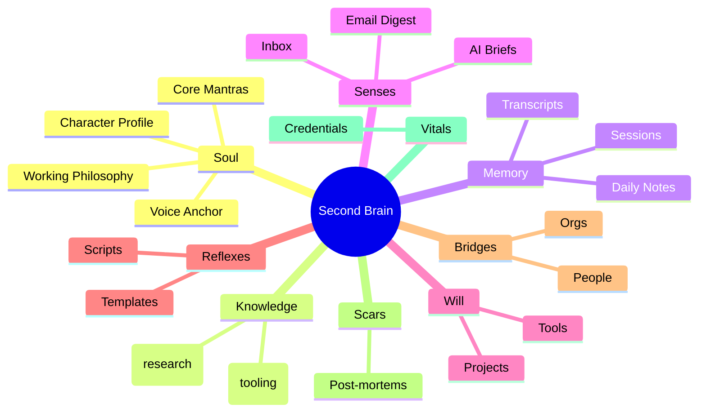
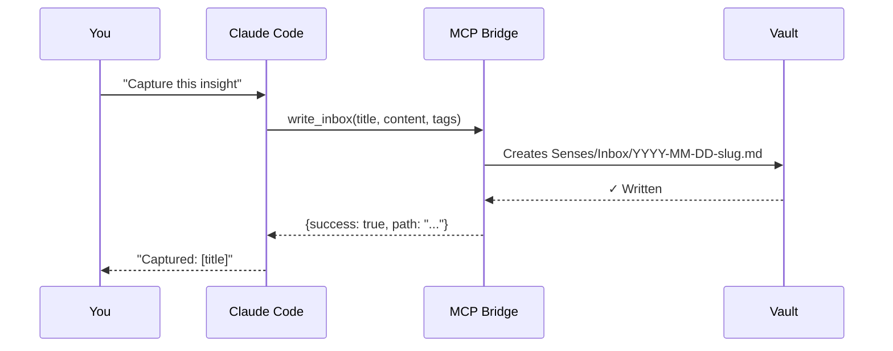
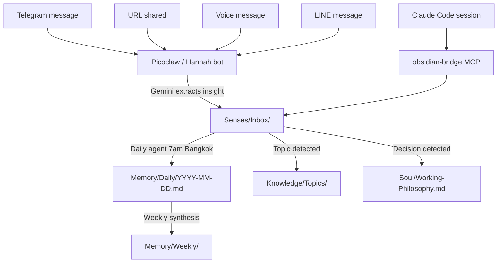
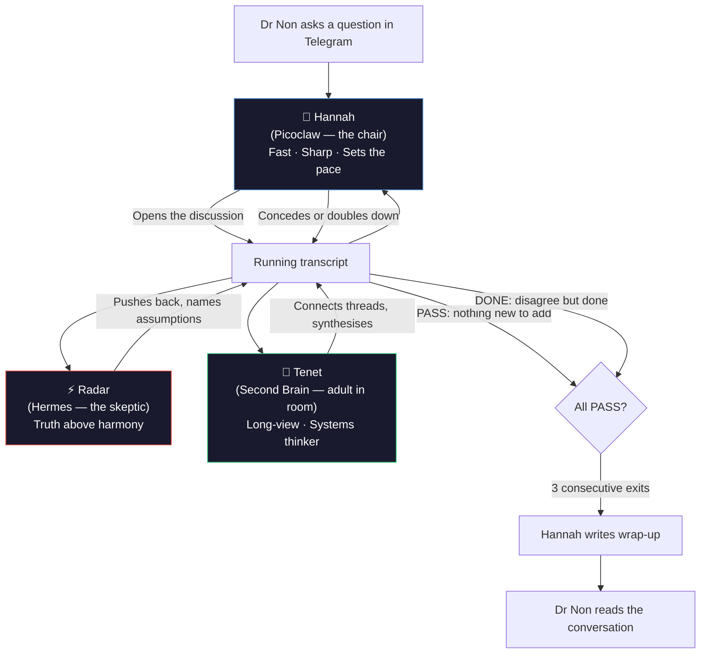
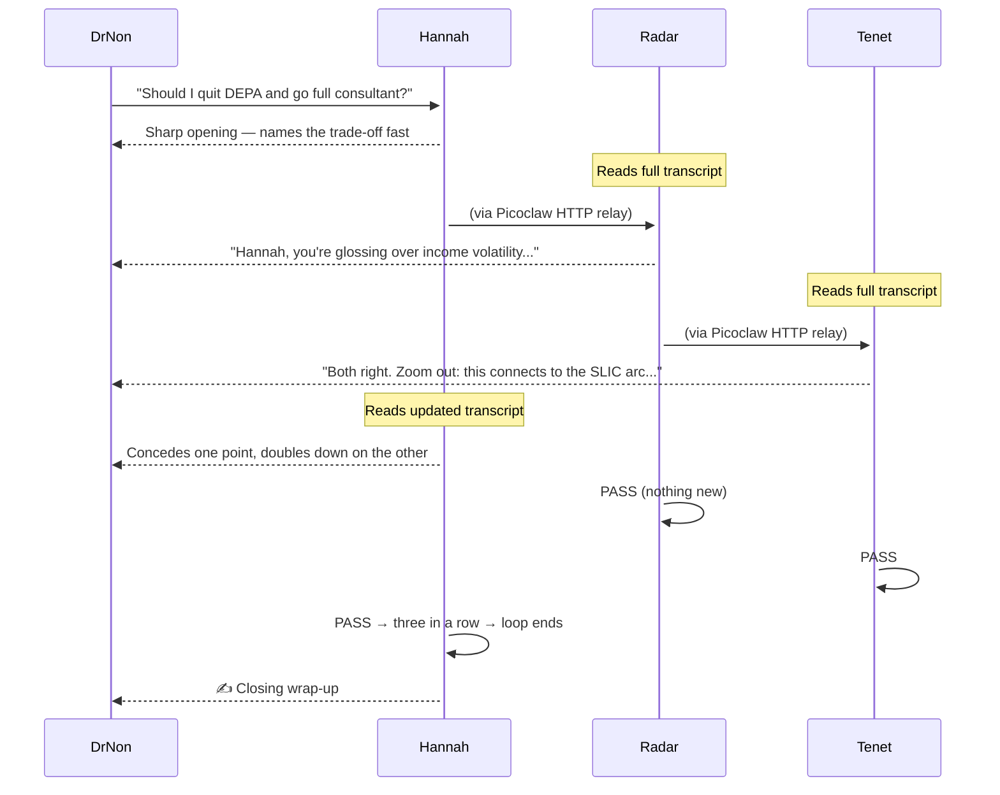
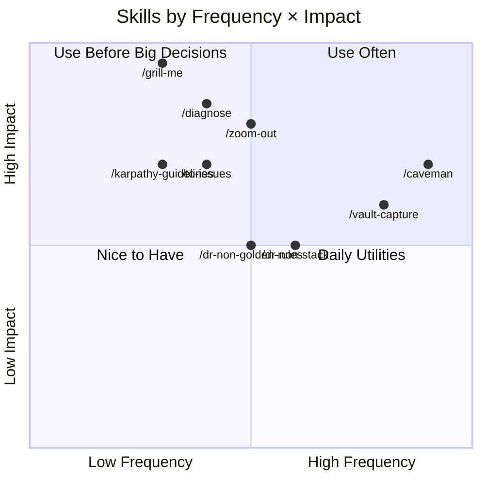
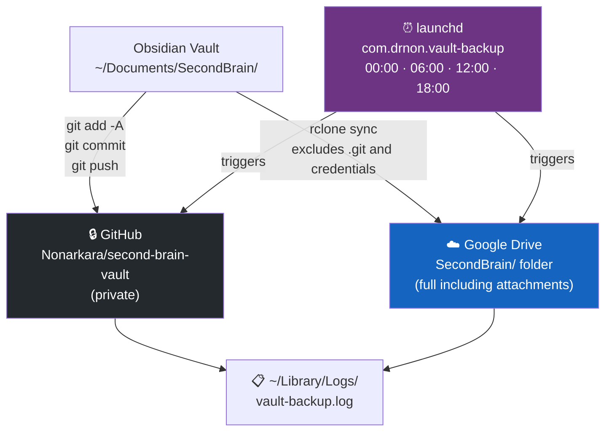
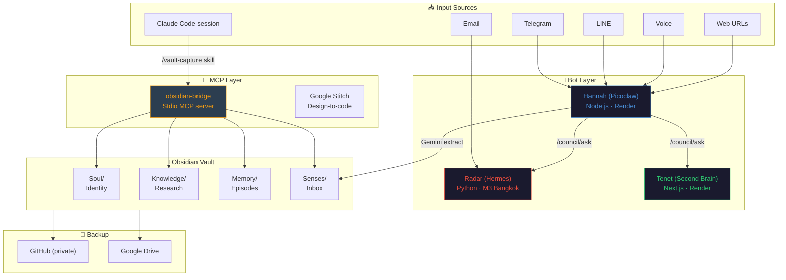
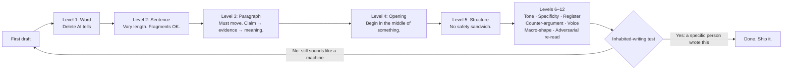

# Second Brain OS

<!-- HERO BANNER — replace the line below with your banner image -->
<!--  -->

> A personal operating system built on Obsidian, Claude Code, and a council of three AI siblings.
> Open-sourced so anyone can build their own.

**Built by [Dr Non Arkaraprasertkul](https://github.com/Nonarkara)** — Harvard-trained anthropologist, MIT-trained architect, smart city expert at DEPA Thailand. This is the actual system he uses to manage 28+ live projects across ASEAN while traveling between Bangkok and Singapore.

---

## What Is This?

Most people use Obsidian as a note-taking app. This treats it as an **operating system** — the persistent memory layer for a human-AI hybrid workspace.

Three components work together:

```
┌─────────────────────────────────────────────────────────┐
│                   YOU                                   │
│   (the human with something to think about)             │
└────────────────────────┬────────────────────────────────┘
                         │
              ┌──────────▼──────────┐
              │   AI Council        │
              │  Hannah · Radar · Tenet │
              │  (deliberate before │
              │   answering)        │
              └──────────┬──────────┘
                         │
              ┌──────────▼──────────┐
              │   Obsidian Vault    │
              │   (the memory)      │
              │   via MCP Bridge    │
              └─────────────────────┘
```

The **AI Council** deliberates. The **vault** remembers. You decide.

---

## The Nine Brain Regions

The vault is organized like a brain — nine regions, each with a distinct function.

```
SecondBrain/
├── Soul/          ← Identity. Who you are. Every AI reads this first.
├── Knowledge/     ← What you know. Topics, research, operational guides.
├── Memory/        ← What happened. Daily notes, sessions, transcripts.
├── Bridges/       ← How you connect. People, projects, organizations.
├── Senses/        ← What's coming in. Inbox, AI briefs, email digests.
├── Reflexes/      ← How you respond. Templates, scripts, automations.
├── Scars/         ← What didn't work. Post-mortems, lessons.
├── Vitals/        ← What keeps you running. Credentials, health, finance.
└── Will/          ← What you want to build. Projects, tools, plans.
```

### Why This Structure?



Each region maps to a cognitive function:
- **Soul** = long-term identity (survives across AI sessions)
- **Knowledge** = declarative memory (what you know)
- **Memory** = episodic memory (what happened, when)
- **Senses** = sensory buffer (what's arriving right now)
- **Will** = working memory (what you're trying to do)

---

## The MCP Bridge

Claude Code connects to the vault through a **Model Context Protocol (MCP) server** — `obsidian-bridge`. This lets Claude read, write, and search the vault without you copy-pasting anything.



### Available MCP Tools

| Tool | What it does |
|---|---|
| `write_inbox` | Drop a note into the inbox — daily agent routes it later |
| `write_note` | Create or overwrite any note at a specific path |
| `read_note` | Read any note by vault path |
| `search_vault` | Full-text search across the entire vault |
| `list_topics` | List all notes in a folder |
| `append_to_daily` | Add to today's daily note (creates it if missing) |
| `get_context` | Get recent daily notes + active projects for AI context |
| `log_decision` | Append a dated decision to the working philosophy file |

### How Information Flows In



---

## The AI Council — Hannah, Radar, Tenet

Three AI siblings who actually deliberate with each other before answering. All named palindromes, like Dr Non.



### The Sibling Protocol



### PASS vs DONE

| Signal | Meaning | Telegram? |
|---|---|---|
| `PASS` | Nothing new to add. Agree with where the discussion is going. | ❌ Not posted |
| `DONE` | Nothing new to add. Still hold a different position. | ❌ Not posted |
| [anything else] | Substantive contribution | ✅ Posted by that bot's own token |

The council never blocks Telegram. Hard cap of 12 total turns as a safety net.

---

## The Skills System

Nine slash commands available in Claude Code. Invoke with `/skill-name`.



| Skill | When to use | Effect |
|---|---|---|
| `/caveman` | Responses getting bloated | ~75% token compression, zero filler |
| `/grill-me` | Before any non-trivial build | One question at a time until all assumptions are stress-tested |
| `/diagnose` | Bug isn't immediately obvious | 6-phase: feedback loop → hypothesise → fix |
| `/zoom-out` | Unfamiliar code area | Maps all modules, callers, dependencies before touching anything |
| `/to-issues` | After planning, before building | Vertical-slice GitHub issues (AFK vs HITL tagged) |
| `/vault-capture` | End of productive session | Distils the key insight into vault inbox via MCP |
| `/dr-non-stack` | Tech stack decisions | Full stack reference for all 28 projects |
| `/dr-non-golden-rules` | Architecture decisions | 14 engineering principles from real deployments |
| `/karpathy-guidelines` | Writing any code | HOW to write it (Musk governs WHETHER, Karpathy governs HOW) |

---

## Engineering Philosophy — Musk + Karpathy

Two frameworks, applied in sequence on every task.

```mermaid
flowchart LR
    TASK[Task arrives] --> MUSK{Musk Gate}

    MUSK --> Q1["1. Who owns this requirement?<br/>Why now?"]
    Q1 --> Q2["2. Can it be deleted?<br/>If yes → delete it"]
    Q2 --> Q3["3. Simplify what remains<br/>(only after deletion)"]
    Q3 --> Q4["4. Ship the smallest testable thing"]
    Q4 --> Q5["5. Automate only after<br/>3 successful manual runs"]

    Q5 --> KARPATHY{Karpathy Gate}
    KARPATHY --> K1["Think before coding<br/>State assumptions"]
    K1 --> K2["Simplicity first<br/>Min code that solves it"]
    K2 --> K3["Surgical changes<br/>Touch only what you must"]
    K3 --> K4["Goal-driven execution<br/>Verifiable goals, loop until done"]

    K4 --> SHIP[Ship]

    style MUSK fill:#e74c3c,color:#fff
    style KARPATHY fill:#3498db,color:#fff
    style SHIP fill:#2ecc71,color:#fff
```



**The key distinction:** Musk governs *whether* something should exist. Karpathy governs *how* to write it. Always run Musk first.

Applied at every scale: workspace → project → module → function → line.

---

## The Backup System

Two independent backups running every 6 hours.



The private vault repo (`second-brain-vault`) stores actual content. This public repo (`second-brain-os`) stores the structure, tools, and configuration.

---

## Architecture Overview

Everything together.



---

## Getting Started

### Prerequisites

- [Obsidian](https://obsidian.md/) installed
- [Claude Code](https://claude.ai/code) installed and authenticated
- Node.js 18+
- Python 3.11+ (for Radar/Hermes)

### Step 1: Clone the vault structure

```bash
git clone https://github.com/Nonarkara/second-brain-os.git
cd second-brain-os

# Create your vault from the template
cp -r vault/ ~/Documents/SecondBrain
```

### Step 2: Install the MCP bridge

```bash
cd mcp/obsidian-bridge
npm install

# Add to your Claude Code MCP config
cp ../config/.mcp.json.example ~/.mcp.json
# Edit ~/.mcp.json — set OBSIDIAN_VAULT to your vault path
```

### Step 3: Add skills to Claude Code

```bash
# Copy skills to Claude Code's skills directory
cp -r skills/* ~/.claude/skills/
```

Or install each skill individually via:
```bash
npx skills@latest add /path/to/second-brain-os/skills/caveman
```

### Step 4: Set up the AI Council (optional)

The council requires three bots with Telegram tokens and a shared group. See [council/README.md](council/README.md) for full setup.

**Minimum viable setup** (Picoclaw/Hannah only):
```bash
cd council/hannah
npm install  # same deps as obsidian-capture-bot
cp .env.example .env
# Fill in TELEGRAM_BOT_TOKEN, COUNCIL_GROUP_ID
npm start
```

### Step 5: Automate backups

```bash
# Install scripts
chmod +x scripts/backup-vault-github.sh scripts/backup-vault-gdrive.sh

# Create GitHub backup repo (private)
gh repo create YOUR_USERNAME/second-brain-vault --private

# Initialize vault as git repo
cd ~/Documents/SecondBrain
git init && git remote add origin https://github.com/YOUR_USERNAME/second-brain-vault.git

# Schedule via launchd (macOS)
cp scripts/com.yourname.vault-backup.plist ~/Library/LaunchAgents/
launchctl load ~/Library/LaunchAgents/com.yourname.vault-backup.plist
```

---

## Writing Craft

The vault includes a complete writing guide at `Knowledge/Topics/writing-craft.md`, combining:

1. **The 12-Level Anti-AI Diagnostic** (from *The Complete Human Writing Prompt*)
2. **Pinker's Liberation Principles** (from *The Sense of Style* and *The Language Instinct*)

Key principles:



**The liberation:** Split infinitives are fine. Ending sentences with prepositions is fine. Singular "they" is five hundred years old. The grammar police were wrong. The ear test is the final judge.

---

## Who Built This

**Dr Non Arkaraprasertkul**

Harvard PhD in Anthropology · MIT MSc in Architecture · Oxford MPhil in Modern Chinese Studies

Currently: Senior Expert, Smart City Promotion, DEPA Thailand — grew Thailand's smart city count from 27 to 100+.

Previously: IDEO Shanghai (urban anthropology), NYU Shanghai (postdoctoral fellow), University of Sydney (senior lecturer in urbanism).

Built 28+ live projects across ASEAN — conflict monitors, city ranking indexes, citizen reporting systems, satellite dashboards — mostly from a laptop, mostly in 45-minute sessions.

> "The best stack is the one that ships. Not the one that scales. Not the one that impresses peers. The one that ships."

GitHub: [Nonarkara](https://github.com/Nonarkara)

---

## What This Is Not

- Not a productivity system (it's an intelligence operating system)
- Not a replacement for thinking (it's infrastructure for better thinking)
- Not a finished product (it evolves as the work evolves)
- Not a template you follow exactly (clone it, break it, make it yours)

---

## License

MIT. Take it, modify it, build on it. The only thing I ask is that you ship something real.

---

*Built with [Claude Code](https://claude.ai/code) · Powered by [Obsidian](https://obsidian.md/) · Backed up to [GitHub](https://github.com/Nonarkara/second-brain-vault)*
