# Dr. Non's Second Brain System

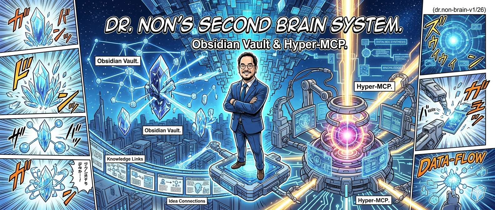

> Obsidian Vault & Hyper-MCP. A personal operating system built on linked knowledge, a council of three AI siblings, and a free-and-open stack that costs nothing to run.
> Open-sourced so anyone can build their own.

**Built by [Dr Non Arkaraprasertkul](https://github.com/Nonarkara)** — Harvard-trained anthropologist, MIT-trained architect, smart city expert at DEPA Thailand. This is the actual system he uses to manage 28+ live projects across ASEAN while traveling between Bangkok and Singapore.

---

## What Is This?

Most people use Obsidian as a note-taking app. This treats it as an **operating system** — the persistent memory layer for a human-AI hybrid workspace.

Three components work together:

```
┌─────────────────────────────────────────────────────────┐
│                   YOU                                   │
│   (the human with something to think about)             │
└────────────────────────┬────────────────────────────────┘
                         │
              ┌──────────▼──────────┐
              │   AI Council        │
              │  Hannah · Radar · Tenet │
              │  (deliberate before │
              │   answering)        │
              └──────────┬──────────┘
                         │
              ┌──────────▼──────────┐
              │   Obsidian Vault    │
              │   (the memory)      │
              │   via MCP Bridge    │
              └─────────────────────┘
```

The **AI Council** deliberates. The **vault** remembers. You decide.

---

## Why This System — A Detailed Analysis

This is not another productivity framework. It is a critique of how knowledge management has been done, and a replacement.

### The Problem with Tabulation

Most knowledge management tools — Notion, Airtable, spreadsheets, even most databases — organize information in **tables**. Rows and columns. A row is a record. A column is a property. You search by filtering columns.

This works for inventory. It fails for thought.

Human thinking does not move in rows. It moves in **connections**. An idea about Bangkok's livability connects to a conversation you had in Taipei last year, which connects to a study about disposable income, which connects to a decision you need to make tomorrow about a project in Phuket. A table cannot hold that chain. It can hold the endpoints, but it loses the path between them.

```
❌ Tabular model:        ✅ Vectorial model (this system):

ID | Topic | Date         "Bangkok livability"
1  | SLIC  | 2026-03       ↕ links to
2  | Phuket| 2026-04       "Disposable income study"
3  | DEPA  | 2026-03        ↕ links to
                           "Taipei SCES panel 2026"
(relationships lost)        ↕ links to
                           "CSCO program 40 mayors"
                           (relationships preserved)
```

Obsidian's graph model treats every note as a **node** and every `[[wikilink]]` as a **vector** — a directed connection between two pieces of knowledge. The graph is two-dimensional on screen, but it is genuinely multi-dimensional in structure: one note can connect to dozens of others, each of which connects to dozens more, creating a traversable knowledge graph that no spreadsheet can replicate.

This is not a theoretical advantage. In practice it means:

- When Dr Non asks his AI council a question, the MCP bridge can traverse backlinks to surface relevant context that no keyword search would find
- When a new smart city project begins, related past projects surface automatically through the link graph — not through manual tagging
- When a decision is made, logging it to `Soul/Working-Philosophy.md` creates a durable connection to every note that links there — every AI agent reading the vault gets that decision in context

### Why the MCP Approach Beats Traditional RAG

Most AI memory systems use **Retrieval-Augmented Generation (RAG)**: embed every document into vectors, store in a vector database, search by cosine similarity when the AI needs context.

RAG has real costs:

| RAG | This System (MCP) |
|---|---|
| Expensive: embedding models + vector DB hosting | Free: plain markdown files on disk |
| Opaque: you don't know what got retrieved | Transparent: you can read every note the AI sees |
| Stale: index must be rebuilt when notes change | Live: reads files directly, always current |
| Complex: 3–5 services to operate | Simple: one Node.js MCP server, zero dependencies |
| Black-box: AI decides what's relevant via similarity | Intentional: you decide what matters via wikilinks |
| Locked in: proprietary vector stores | Portable: plain text, works offline, no API calls |

The MCP bridge is not smarter than RAG. It is more honest. It reads what you wrote, exactly as you wrote it, and gives it to the AI directly. No embedding, no similarity threshold, no retrieval hallucination. The AI sees the actual note.

And because the vault uses Obsidian's link graph instead of semantic similarity, **you** decide what connects to what — not a distance function trained on someone else's corpus.

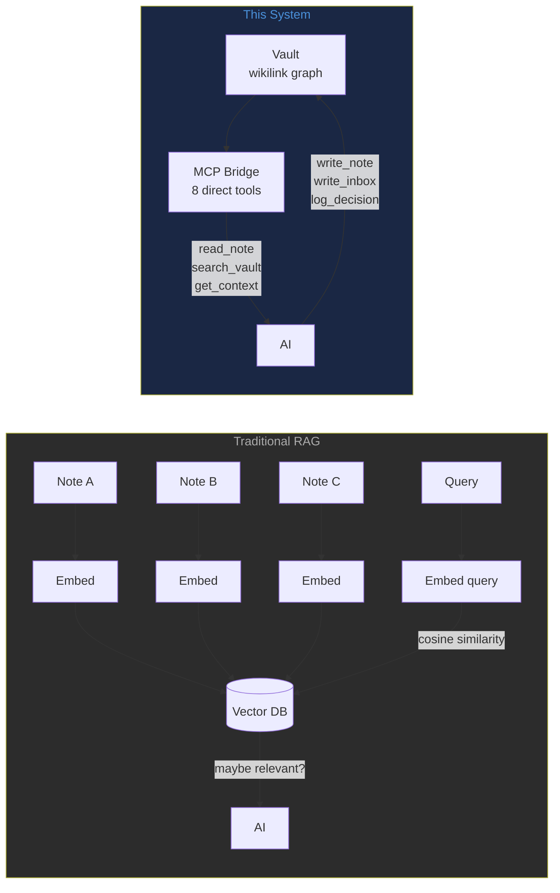

### The Architectural Logic — Trial, Error, and the MIT Way

This system was not designed from first principles. It was built the way Dr Non builds everything: start with the problem, build the smallest thing that addresses it, throw away what doesn't work, keep what does.

The evolution:

```
2025 Q3   Obsidian alone — just taking notes
          Problem: notes don't talk to AI, AI doesn't remember notes

2025 Q4   First MCP bridge — Claude Code can read/write the vault
          Problem: AI reads everything, but has no sense of what matters

2025 Q4   Soul layer — identity files AI reads before everything else
          Problem: AI gives good answers, but each session starts cold

2026 Q1   Council (Hannah/Radar/Tenet) — three bots deliberate before answering
          Problem: bots only talk to Dr Non, not to each other

2026 Q2   Sequential debate loop — bots read each other's transcript via HTTP
          Result: genuine deliberation, named disagreements, PASS/DONE protocol

2026 Q2   SCES 2026, Taipei — Dr Non demos the conflict monitor live on stage
          Realization: the same "build before procure" philosophy applies to AI systems
```

The key insight from the MIT training (not the Carnegie Mellon way): **take what already exists and put it together quickly**. Obsidian already exists. MCP already exists. Telegram bots already exist. The Gemini and Claude APIs already exist. No part of this system required inventing new technology. It required connecting the right pieces in the right order.

The architectural mind behind it thinks in **spaces**, not tables. An architect sees a building not as a list of rooms but as a network of flows — how people move, what they see from where, which spaces activate which other spaces. Applied to knowledge: not "what category does this belong to" but "what does this connect to, and what does that unlock."

This is why the vault has nine brain **regions**, not nine categories. Regions have topology. Categories have only membership.

### The Cost Argument — Genuinely Free

Every component of this system runs at zero marginal cost:

| Component | Cost | Alternative |
|---|---|---|
| Obsidian | Free (personal use) | Notion $8–16/month |
| obsidian-bridge MCP | Free (self-hosted, ~50 MB RAM) | Mem.ai $10/month |
| Telegram bots | Free (unlimited messages) | Slack $7.25/user/month |
| GitHub (vault backup) | Free (private repo) | Dropbox $10/month |
| Google Drive (full backup) | Free (rclone sync to existing account) | Backblaze $7/month |
| Claude Code skills | Free (markdown files) | Custom tooling |
| Cloudflare Tunnel | Free | ngrok $8/month |

The only paid component is Claude Code itself (Anthropic subscription), because a good reasoning engine is the point of the whole system. Everything else — the storage, the sync, the bots, the tunneling, the backup — is zero.

The monthly cost of running this system, excluding Claude Code: **$0.**

### What the Banner Shows

The manga aesthetic is intentional. The image shows:

- **The crystals on the left** = knowledge nodes in the Obsidian graph. Each crystal is a note. The energy lines between them are wikilinks. The graph looks like explosion of light because knowledge, properly connected, is explosive.
- **Dr Non at the center** = the human intelligence that decides what matters. The system serves him, not the other way around.
- **The MCP reactor on the right** = the Hyper-MCP core — obsidian-bridge, the council endpoints, the backup automation. The reactor glows because it processes continuously (captures, backups, daily briefs every 6 hours).
- **The data-flow lines** = the pipeline: Telegram → Hannah → transcript → Radar → Tenet → vault → GitHub → Google Drive.
- **The manga panel borders** = this is version 1 of something that will have many versions. Comic panels show sequence. This system evolves frame by frame, like a story.
- **(dr.non-brain-v1/26)** = version 1, 2026.

---

## The Nine Brain Regions

The vault is organized like a brain — nine regions, each with a distinct function.

```
SecondBrain/
├── Soul/          ← Identity. Who you are. Every AI reads this first.
├── Knowledge/     ← What you know. Topics, research, operational guides.
├── Memory/        ← What happened. Daily notes, sessions, transcripts.
├── Bridges/       ← How you connect. People, projects, organizations.
├── Senses/        ← What's coming in. Inbox, AI briefs, email digests.
├── Reflexes/      ← How you respond. Templates, scripts, automations.
├── Scars/         ← What didn't work. Post-mortems, lessons.
├── Vitals/        ← What keeps you running. Credentials, health, finance.
└── Will/          ← What you want to build. Projects, tools, plans.
```

### Why This Structure?

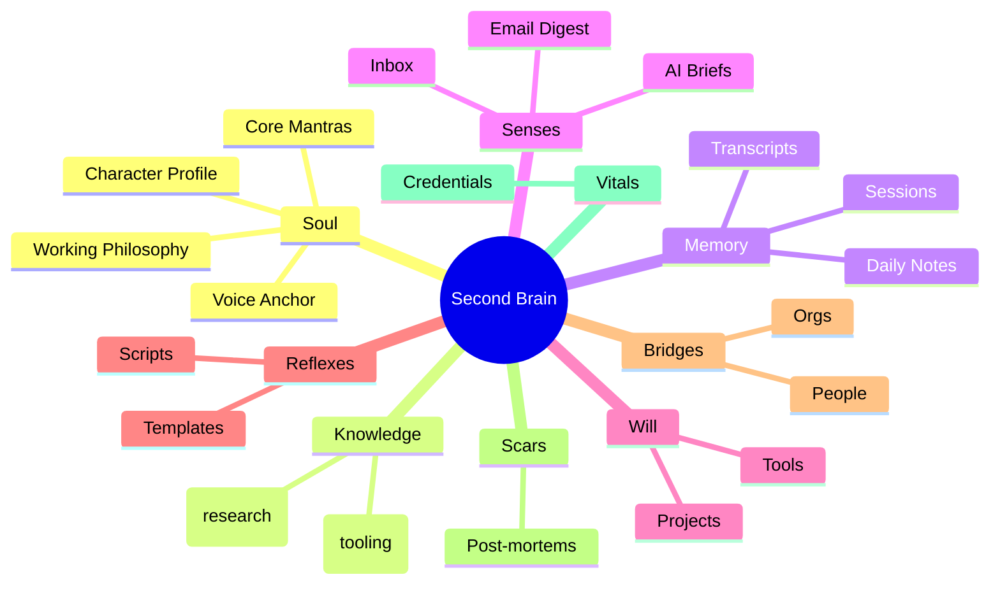

Each region maps to a cognitive function:
- **Soul** = long-term identity (survives across AI sessions)
- **Knowledge** = declarative memory (what you know)
- **Memory** = episodic memory (what happened, when)
- **Senses** = sensory buffer (what's arriving right now)
- **Will** = working memory (what you're trying to do)

---

## The MCP Bridge

Claude Code connects to the vault through a **Model Context Protocol (MCP) server** — `obsidian-bridge`. This lets Claude read, write, and search the vault without you copy-pasting anything.

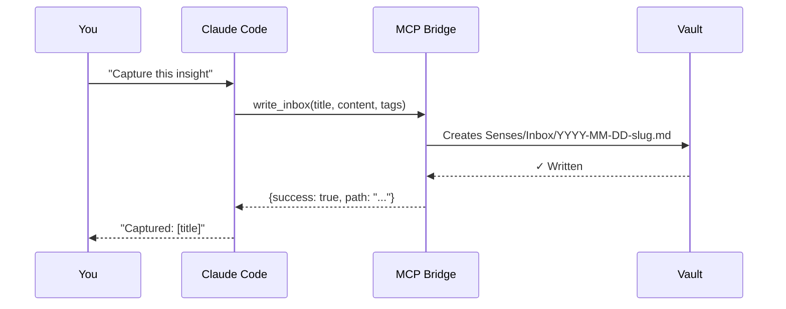

### Available MCP Tools

| Tool | What it does |
|---|---|
| `write_inbox` | Drop a note into the inbox — daily agent routes it later |
| `write_note` | Create or overwrite any note at a specific path |
| `read_note` | Read any note by vault path |
| `search_vault` | Full-text search across the entire vault |
| `list_topics` | List all notes in a folder |
| `append_to_daily` | Add to today's daily note (creates it if missing) |
| `get_context` | Get recent daily notes + active projects for AI context |
| `log_decision` | Append a dated decision to the working philosophy file |

### How Information Flows In

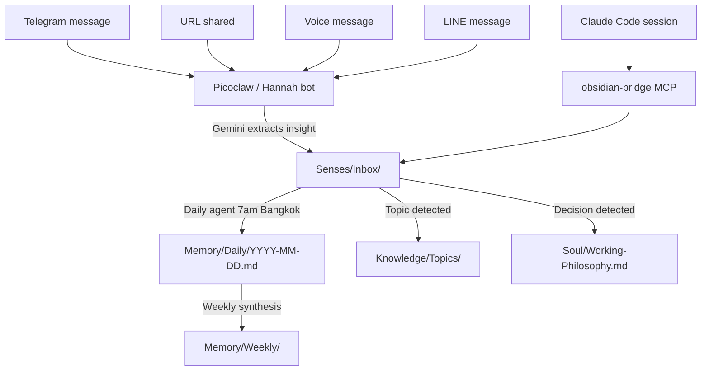

---

## The AI Council — Hannah, Radar, Tenet

Three AI siblings who actually deliberate with each other before answering. All named palindromes, like Dr Non.

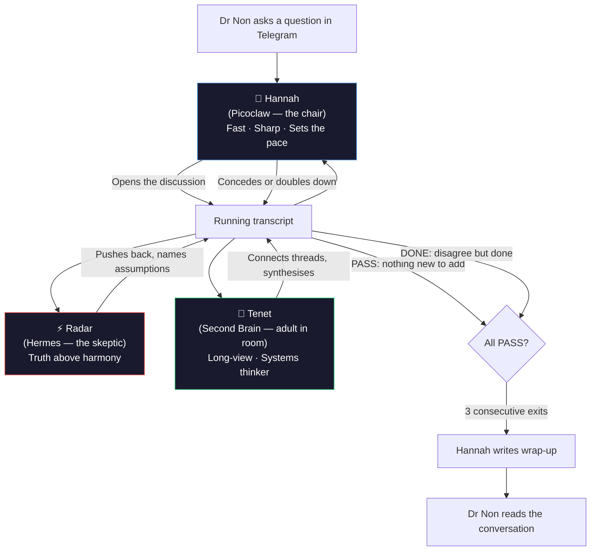

### The Sibling Protocol

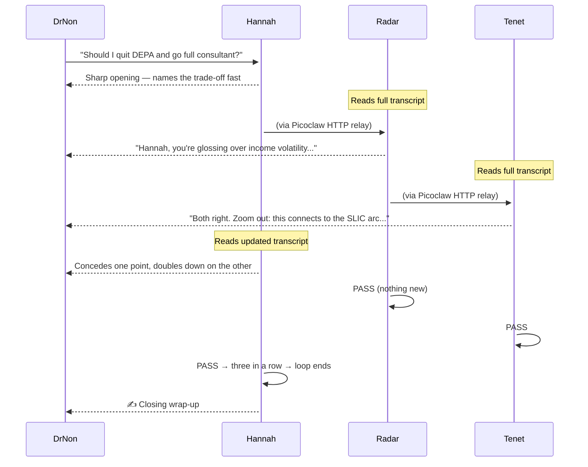

### PASS vs DONE

| Signal | Meaning | Telegram? |
|---|---|---|
| `PASS` | Nothing new to add. Agree with where the discussion is going. | ❌ Not posted |
| `DONE` | Nothing new to add. Still hold a different position. | ❌ Not posted |
| [anything else] | Substantive contribution | ✅ Posted by that bot's own token |

The council never blocks Telegram. Hard cap of 12 total turns as a safety net.

---

## The Skills System

Nine slash commands available in Claude Code. Invoke with `/skill-name`.

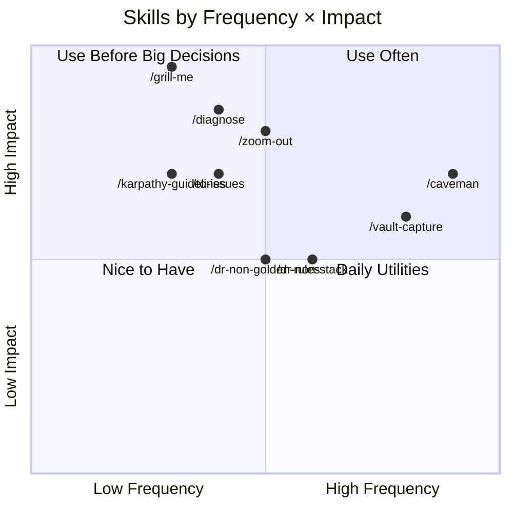

| Skill | When to use | Effect |
|---|---|---|
| `/caveman` | Responses getting bloated | ~75% token compression, zero filler |
| `/grill-me` | Before any non-trivial build | One question at a time until all assumptions are stress-tested |
| `/diagnose` | Bug isn't immediately obvious | 6-phase: feedback loop → hypothesise → fix |
| `/zoom-out` | Unfamiliar code area | Maps all modules, callers, dependencies before touching anything |
| `/to-issues` | After planning, before building | Vertical-slice GitHub issues (AFK vs HITL tagged) |
| `/vault-capture` | End of productive session | Distils the key insight into vault inbox via MCP |
| `/dr-non-stack` | Tech stack decisions | Full stack reference for all 28 projects |
| `/dr-non-golden-rules` | Architecture decisions | 14 engineering principles from real deployments |
| `/karpathy-guidelines` | Writing any code | HOW to write it (Musk governs WHETHER, Karpathy governs HOW) |

---

## Engineering Philosophy — Musk + Karpathy

Two frameworks, applied in sequence on every task.

```mermaid
flowchart LR
    TASK[Task arrives] --> MUSK{Musk Gate}

    MUSK --> Q1["1. Who owns this requirement?<br/>Why now?"]
    Q1 --> Q2["2. Can it be deleted?<br/>If yes → delete it"]
    Q2 --> Q3["3. Simplify what remains<br/>(only after deletion)"]
    Q3 --> Q4["4. Ship the smallest testable thing"]
    Q4 --> Q5["5. Automate only after<br/>3 successful manual runs"]

    Q5 --> KARPATHY{Karpathy Gate}
    KARPATHY --> K1["Think before coding<br/>State assumptions"]
    K1 --> K2["Simplicity first<br/>Min code that solves it"]
    K2 --> K3["Surgical changes<br/>Touch only what you must"]
    K3 --> K4["Goal-driven execution<br/>Verifiable goals, loop until done"]

    K4 --> SHIP[Ship]

    style MUSK fill:#e74c3c,color:#fff
    style KARPATHY fill:#3498db,color:#fff
    style SHIP fill:#2ecc71,color:#fff
```

**The key distinction:** Musk governs *whether* something should exist. Karpathy governs *how* to write it. Always run Musk first.

Applied at every scale: workspace → project → module → function → line.

---

## The Backup System

Two independent backups running every 6 hours.

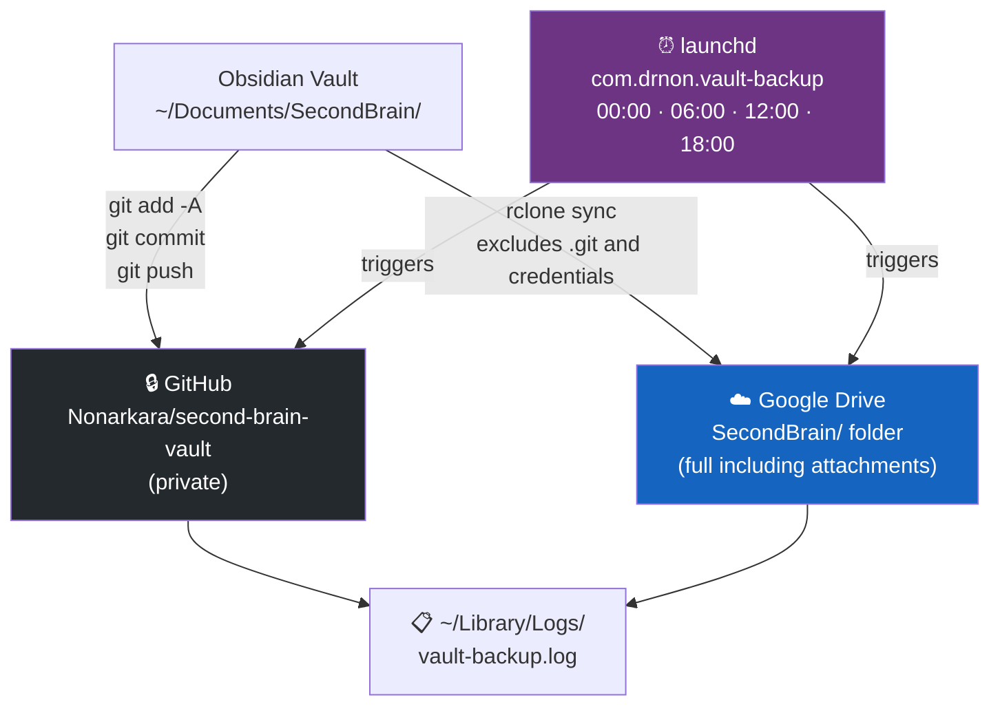

The private vault repo (`second-brain-vault`) stores actual content. This public repo (`second-brain-os`) stores the structure, tools, and configuration.

---

## Architecture Overview

Everything together.

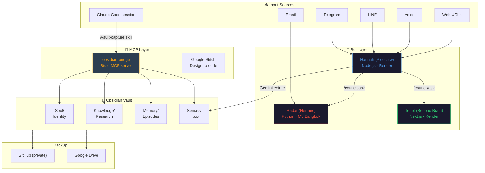

---

## Getting Started

### Prerequisites

- [Obsidian](https://obsidian.md/) installed
- [Claude Code](https://claude.ai/code) installed and authenticated
- Node.js 18+
- Python 3.11+ (for Radar/Hermes)

### Step 1: Clone the vault structure

```bash
git clone https://github.com/Nonarkara/second-brain-os.git
cd second-brain-os

# Create your vault from the template
cp -r vault/ ~/Documents/SecondBrain
```

### Step 2: Install the MCP bridge

```bash
cd mcp/obsidian-bridge
npm install

# Add to your Claude Code MCP config
cp ../config/.mcp.json.example ~/.mcp.json
# Edit ~/.mcp.json — set OBSIDIAN_VAULT to your vault path
```

### Step 3: Add skills to Claude Code

```bash
# Copy skills to Claude Code's skills directory
cp -r skills/* ~/.claude/skills/
```

Or install each skill individually via:
```bash
npx skills@latest add /path/to/second-brain-os/skills/caveman
```

### Step 4: Set up the AI Council (optional)

The council requires three bots with Telegram tokens and a shared group. See [council/README.md](council/README.md) for full setup.

**Minimum viable setup** (Picoclaw/Hannah only):
```bash
cd council/hannah
npm install  # same deps as obsidian-capture-bot
cp .env.example .env
# Fill in TELEGRAM_BOT_TOKEN, COUNCIL_GROUP_ID
npm start
```

### Step 5: Automate backups

```bash
# Install scripts
chmod +x scripts/backup-vault-github.sh scripts/backup-vault-gdrive.sh

# Create GitHub backup repo (private)
gh repo create YOUR_USERNAME/second-brain-vault --private

# Initialize vault as git repo
cd ~/Documents/SecondBrain
git init && git remote add origin https://github.com/YOUR_USERNAME/second-brain-vault.git

# Schedule via launchd (macOS)
cp scripts/com.yourname.vault-backup.plist ~/Library/LaunchAgents/
launchctl load ~/Library/LaunchAgents/com.yourname.vault-backup.plist
```

---

## Writing Craft

The vault includes a complete writing guide at `Knowledge/Topics/writing-craft.md`, combining:

1. **The 12-Level Anti-AI Diagnostic** (from *The Complete Human Writing Prompt*)
2. **Pinker's Liberation Principles** (from *The Sense of Style* and *The Language Instinct*)

Key principles:

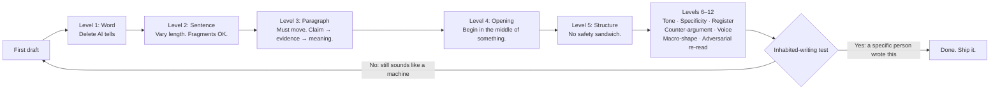

**The liberation:** Split infinitives are fine. Ending sentences with prepositions is fine. Singular "they" is five hundred years old. The grammar police were wrong. The ear test is the final judge.

---

## Who Built This

**Dr Non Arkaraprasertkul**

Harvard PhD in Anthropology · MIT MSc in Architecture · Oxford MPhil in Modern Chinese Studies

Currently: Senior Expert, Smart City Promotion, DEPA Thailand — grew Thailand's smart city count from 27 to 100+.

Previously: IDEO Shanghai (urban anthropology), NYU Shanghai (postdoctoral fellow), University of Sydney (senior lecturer in urbanism).

Built 28+ live projects across ASEAN — conflict monitors, city ranking indexes, citizen reporting systems, satellite dashboards — mostly from a laptop, mostly in 45-minute sessions.

> "The best stack is the one that ships. Not the one that scales. Not the one that impresses peers. The one that ships."

GitHub: [Nonarkara](https://github.com/Nonarkara)

---

## What This Is Not

- Not a productivity system (it's an intelligence operating system)
- Not a replacement for thinking (it's infrastructure for better thinking)
- Not a finished product (it evolves as the work evolves)
- Not a template you follow exactly (clone it, break it, make it yours)

---

## License

MIT. Take it, modify it, build on it. The only thing I ask is that you ship something real.

---

*Built with [Claude Code](https://claude.ai/code) · Powered by [Obsidian](https://obsidian.md/) · Backed up to [GitHub](https://github.com/Nonarkara/second-brain-vault)*
