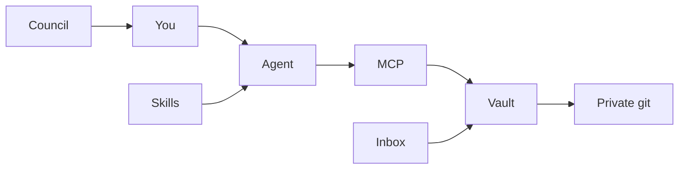
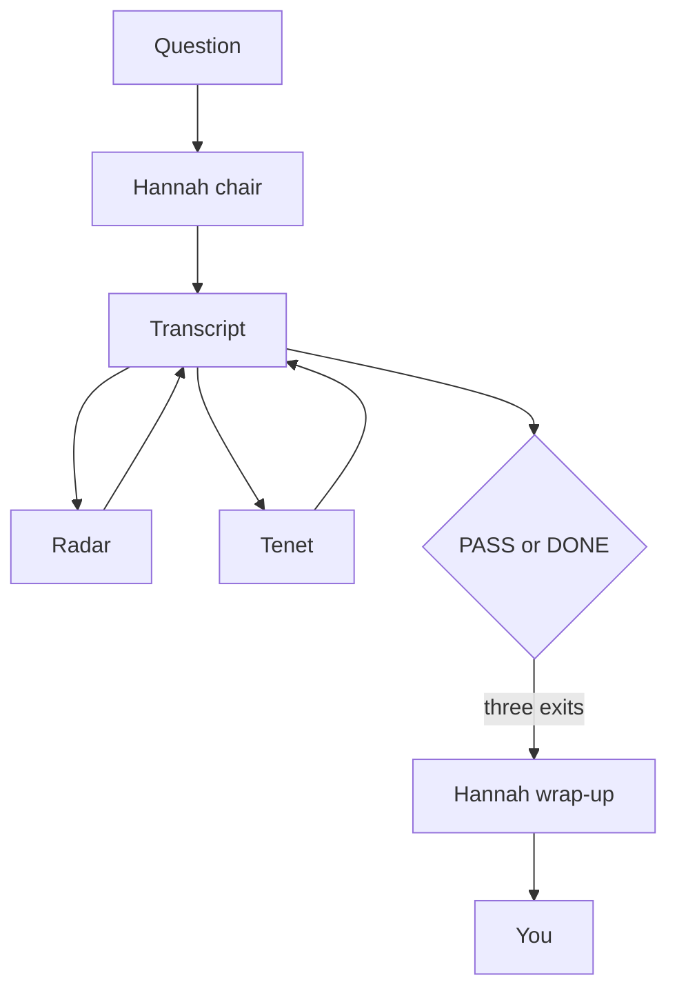
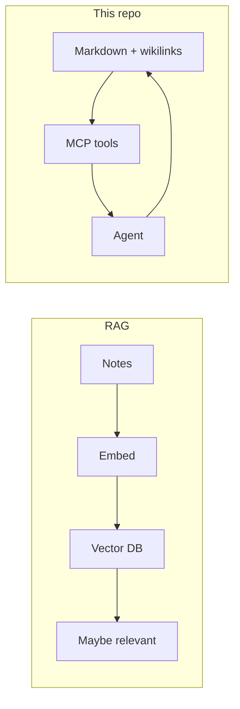

<p align="center">
  
</p>
<p align="center"><em>The second brain as a workshop, not a dashboard — linked notes, one person who decides, a council that argues.</em></p>

# Second Brain OS

**A personal operating system: an Obsidian vault, an agent that can read it, and a council that deliberates before it answers.**

[](LICENSE)
[](https://obsidian.md/)
[](docs/obsidian-mcp-setup.md)

By [Non Arkaraprasertkul](https://github.com/Nonarkara) (Nonarkara) — architect, urban anthropologist, and founder of **[Axiom X Co., Ltd.](https://axiom.nonarkara.org)**, a one-desk civic studio in Bangkok.

This repository is independent studio work. It is **not** an official depa, ASEAN, or municipal product. There is no hosted “live second brain” URL here — you run it on your own machine.

**ไทย / English.** The studio audience is bilingual. This README is English-first so forks worldwide can follow it; keep Thai in the vault and in the work.

---

## What this is

Most people use Obsidian as a notebook. This repo treats a vault as the **memory layer** of a human–agent workspace: notes stay plain markdown, the agent reads and writes them as tools, and (optionally) three named siblings argue before a hard answer lands.

What is in **this** public tree:

| Path | What you actually get |
|---|---|
| [`vault/`](vault/) | Nine empty brain *regions* (folders + `.gitkeep`). Identity notes under `Soul/` are **not** shipped — only [`vault/Soul/README.md`](vault/Soul/README.md). |
| [`docs/obsidian-mcp-setup.md`](docs/obsidian-mcp-setup.md) | The 2026 setup: official *Local REST API with MCP* plugin. If Obsidian is running, the MCP server is running. |
| [`mcp/obsidian-bridge/`](mcp/obsidian-bridge/) | A filesystem MCP example. **Superseded** for day-to-day use; kept for the case where Obsidian is closed. |
| [`mcp/config/.mcp.json.example`](mcp/config/.mcp.json.example) | Placeholder MCP client config. The API key is yours; never commit it. |
| [`skills/`](skills/) | Nine Claude Code skills (slash commands) as markdown. |
| [`council/`](council/) | Sequential-debate protocol: Hannah (chair), Radar (skeptic), Tenet (long view). Endpoints and orchestrator — not a hosted Telegram product. |
| [`braind/`](braind/) | A one-shot “pulse” worker: transfer when online, compute when offline. Keys stay in the operator’s environment. |
| [`scripts/`](scripts/) | macOS-oriented vault backup helpers (private git + rclone). |

The **AI council** deliberates. The **vault** remembers. You decide.

**This repo is not:**

- Your (or anyone’s) private notes. Actual daily notes belong in a vault you control — the public README names a private backup repo as the author’s pattern, not as a URL to clone.
- A ranking, a dashboard, or a government system.
- A complete Picoclaw/Telegram bot. `council/hannah/council.js` imports a local `router.js` that is **not** in this tree.
- A dump of API keys, Telegram tokens, Obsidian `data.json`, or capture-host URLs.

Related public work: [live-coding bible](https://github.com/Nonarkara/live-coding-bible) (tactic 05 is the second-brain *pipeline* pattern), [dr-non-agentic-ai-council](https://github.com/Nonarkara/dr-non-agentic-ai-council), [vibecoding skills](https://github.com/Nonarkara/dr-non-vibecoding-skills).

---

## Philosophy

Four studio tenets. They are how this repo is meant to be forked, not slogans.

**Fork the method, not the secrets.** The vault *shape*, the MCP tools, the PASS/DONE council protocol, and the skills are the public claim. Personal notes, Soul identity files, Telegram tokens, Obsidian API keys, and backup remotes are not. If a learner needs your diary to use the system, the system failed.

**One Mac.** Obsidian + an MCP-capable agent + this tree. The recommended 2026 path is the official plugin’s built-in MCP server — no extra Node process to babysit, no vector database bill, no data centre. `braind` is a pulse launched by `launchd`, not a cluster.

**No black-box rankings.** This is not a city index, and it is not RAG-as-oracle. You choose the `[[wikilinks]]`. The agent reads the note you wrote, not a cosine score from someone else’s corpus. If you cannot open the file the model saw, it does not belong in the loop.

**ไทย / English as the audience.** Civic-studio work in this account is bilingual. Agents should be able to write both; this README stays English-first so an international fork can run it without guessing.

The graph-vs-table argument is the same honesty move as an open city score: **connections you declared**, not a hidden ranking of “what the model thought was relevant.”

Company: **Axiom X Co., Ltd.** Author: **Non Arkaraprasertkul** ([Nonarkara](https://github.com/Nonarkara)).

---

## Ethical use

This is infrastructure for **your** thinking and for public-good civic software. It is not a kit for surveillance, for scraping other people’s vaults, or for pretending a private capture pipeline is an official brain.

**Do**

- Treat the Obsidian Local REST API key as a **full read/write password** to the vault. It lives in the plugin’s `data.json`. Committing `.obsidian` can publish it. This repo’s `.gitignore` already blocks `data.json`.
- Keep Telegram bot tokens, `COUNCIL_SECRET`, `BRAIND_KEY`, rclone credentials, and backup remotes in the operator’s environment. Placeholders only in git (`YOUR_OBSIDIAN_API_KEY`, `.env.example` if you add one).
- Leave vault law in place if you run `braind`: notes it writes are meant to be `status: candidate` until a human promotes them.
- Say what this is: a personal OS from a Bangkok studio. Do not imply depa, a municipality, or ASEAN ships it.

**Do not**

- Commit `Soul/` identity files, `Vitals/`, session transcripts, or inbox captures. Those paths are gitignored here for a reason.
- Point learners at the author’s private capture API or a private `second-brain-vault` clone. Fork the method; wire **your** host.
- Use the council or MCP tools to collect more personal data than the operator consented to put in the vault.
- Dress a custom fork as “Dr Non’s official brain,” or paste someone else’s notes into a public fork “as a demo.”

If a contribution would only work by pasting a secret, it does not belong here.

---

## How to use / learn

If you read one file after this README, read **[`docs/obsidian-mcp-setup.md`](docs/obsidian-mcp-setup.md)**. It is the tested loop: plugin → API key → restart Obsidian → verify a listen port → point your agent at `http://127.0.0.1:27123/mcp`.

### What you need

- [Obsidian](https://obsidian.md/)
- An MCP-capable agent ([Claude Code](https://claude.ai/code) is what the setup guide was written against)
- Node.js 18+ if you run the filesystem bridge
- Python 3.11+ only if you stand up Radar’s Flask endpoint

You do **not** need the author’s Telegram group, a vector database, or any secret from this repository.

### 1. Clone the structure

```bash
git clone https://github.com/Nonarkara/second-brain-os.git
cd second-brain-os
cp -r vault/ ~/Documents/SecondBrain   # or any vault path you choose
```

Open that folder as an Obsidian vault. Fill `Soul/` yourself — the public repo on purpose does not.

Nine regions (folders in `vault/`):

| Region | Job |
|---|---|
| **Soul** | Identity the agent should read first |
| **Knowledge** | Topics, research, tooling notes |
| **Memory** | Daily notes, sessions, transcripts |
| **Bridges** | People, projects, organisations |
| **Senses** | Inbox, briefs, captures |
| **Reflexes** | Templates, scripts |
| **Scars** | Post-mortems |
| **Vitals** | Health / finance / credentials — keep this **off** git |
| **Will** | Projects and plans |

### 2. Connect the agent (recommended)

Follow [`docs/obsidian-mcp-setup.md`](docs/obsidian-mcp-setup.md). Copy [`mcp/config/.mcp.json.example`](mcp/config/.mcp.json.example), put **your** key in, and never commit the result.

The #1 failure mode in that guide: enabling the plugin does not start the server until you fully quit and reopen Obsidian. Verify with `lsof` before debugging the agent.

**Filesystem bridge** (only if you need the vault while Obsidian is closed):

```bash
cd mcp/obsidian-bridge
npm install
# OBSIDIAN_VAULT=/absolute/path/to/vault  — see mcp/obsidian-bridge/README.md
```

Prefer a maintained filesystem MCP server over this example for production headless use. This bridge is a worked sample.

### 3. Skills

```bash
cp -r skills/* ~/.claude/skills/
```

| Skill | When |
|---|---|
| `/caveman` | Answers got bloated — denser prose, same facts |
| `/grill-me` | Before a non-trivial build — one question at a time |
| `/diagnose` | Bug is not obvious — feedback loop, then hypothesise, then fix |
| `/zoom-out` | Unfamiliar code — map callers and blast radius first |
| `/to-issues` | Plan → vertical-slice GitHub issues |
| `/vault-capture` | End of a session — one insight into the inbox (needs vault MCP) |
| `/dr-non-stack` | Scaffold / design defaults for a civic surface |
| `/dr-non-golden-rules` | Whether to build, keep, or kill |
| `/karpathy-guidelines` | How to write the code (surgical, assumptions visible) |

### 4. Council (optional, protocol not a product)

Three palindrome names: **Hannah** (chair, fast), **Radar** (skeptic), **Tenet** (long view). They take turns on a shared transcript. `PASS` = nothing new, agree. `DONE` = nothing new, still disagree. Neither is posted to Telegram. Hard cap of 12 turns in the orchestrator.

Study:

- [`council/hannah/council.js`](council/hannah/council.js) — sequential debate loop (expects a local `router.js` **not** shipped here)
- [`council/radar/council-endpoint.py`](council/radar/council-endpoint.py) — Flask `POST /council/ask`
- [`council/reference/council-endpoint.js`](council/reference/council-endpoint.js) — Node reference for another member

Tokens (`TELEGRAM_BOT_TOKEN`, `COUNCIL_SECRET`, `COUNCIL_GROUP_ID`, member URLs) are environment variables. There is no `.env.example` and no `council/README.md` in this checkout — that is a gap, not an invitation to invent a hosted URL.

### 5. Backups and the pulse (optional, your machine)

[`scripts/backup-vault-github.sh`](scripts/backup-vault-github.sh) commits a vault git repo and pushes. [`scripts/backup-vault-gdrive.sh`](scripts/backup-vault-gdrive.sh) rclone-syncs, excluding `.git`, cache, and credential-like files. Both assume macOS paths (`~/Documents/SecondBrain`, `~/Library/Logs`). Point them at **your** private remote. No `launchd` plist is committed here.

[`braind/`](braind/) is a one-pulse Node worker (`node braind.mjs`). Online: pull captures / snapshots if a key is set. Offline: still compute (local index + optional Ollama pulse note). Configure `OBSIDIAN_VAULT` and keys in the environment. Do not commit them. Do not treat the default API host in source as a public learner endpoint.

---

## System diagram

Short labels so GitHub does not clip the chart.





Wikilink graph in, similarity-oracle out: the MCP path reads files; you own the links.



---

## License / contributing

[MIT](LICENSE). Copyright © 2025–2026 **Non Arkaraprasertkul / Axiom X Co., Ltd.**

Reuse the vault shape, the MCP pattern, the council protocol, and the skills with attribution. The grant covers **this repository**. It does not relicense Obsidian, Anthropic, Telegram, rclone, or anyone’s private notes.

**Contributing**

- Open a pull request against `main`.
- Do not add secrets, live tokens, personal Soul files, or capture-host URLs.
- Do not rewrite the philosophy to taste. A new skill or a clearer setup step is welcome; a black-box “memory vendor” swap is not.
- If you are unsure whether a string is a secret, leave it out.

If you build a second brain with this method, the studio would like to see it — on your terms, with your vault still private.
