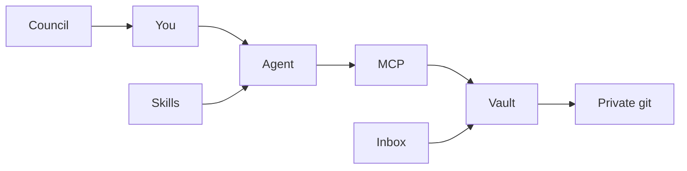
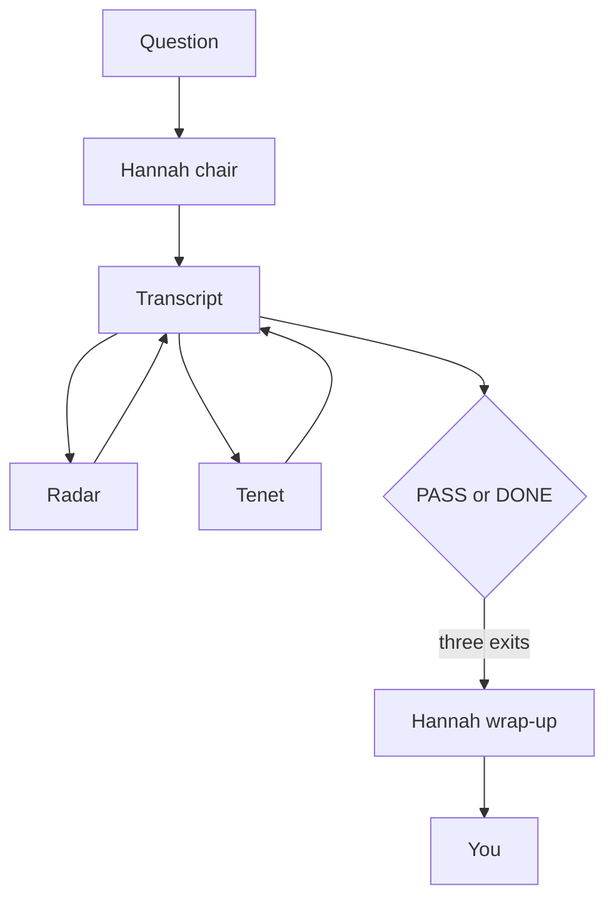
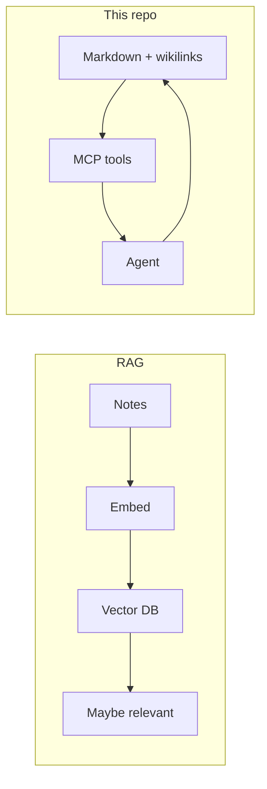

<p align="center">
  
</p>
<p align="center"><em>The second brain as a workshop, not a dashboard — linked notes, one person who decides, a council that argues.</em></p>

# Second Brain OS

**A personal operating system: an Obsidian vault, an agent that can read it, and a council that deliberates before it answers.**

[](LICENSE)
[](https://obsidian.md/)
[](docs/obsidian-mcp-setup.md)

By [Non Arkaraprasertkul](https://github.com/Nonarkara) (Nonarkara) — architect, urban anthropologist, and founder of **[Axiom X Co., Ltd.](https://axiom.nonarkara.org)**, a one-desk civic studio in Bangkok.

This repository is independent studio work. It is **not** an official depa, ASEAN, or municipal product. There is no hosted “live second brain” URL here — you run it on your own machine.

**ไทย / English.** The studio audience is bilingual. This README is English-first so forks worldwide can follow it; keep Thai in the vault and in the work.

---

## What this is

Most people use Obsidian as a notebook. This repo treats a vault as the **memory layer** of a human–agent workspace: notes stay plain markdown, the agent reads and writes them as tools, and (optionally) three named siblings argue before a hard answer lands.

What is in **this** public tree:

| Path | What you actually get |
|---|---|
| [`vault/`](vault/) | Nine empty brain *regions* (folders + `.gitkeep`). Identity notes under `Soul/` are **not** shipped — only [`vault/Soul/README.md`](vault/Soul/README.md). |
| [`docs/obsidian-mcp-setup.md`](docs/obsidian-mcp-setup.md) | **A+ coding MCP:** filesystem forge + disposable recall index (cull / smoke / eval). Optional Local REST API alternate. |
| [`mcp/obsidian-bridge/`](mcp/obsidian-bridge/) | Production **filesystem** MCP for Cursor/Claude/Codex — works with Obsidian open or closed. |
| [`mcp/obsidian-memory/`](mcp/obsidian-memory/) | Local `brain` CLI: index / recall / capture / audit / eval (SQLite + optional Ollama embeds). |
| [`mcp/config/.mcp.json.example`](mcp/config/.mcp.json.example) | Stdio forge wiring for Cursor / Claude. `node` or `command -v node` on this machine. |
| [`mcp/config/codex-config.toml.example`](mcp/config/codex-config.toml.example) | Codex `[mcp_servers.obsidian]` block, including timeouts and `OBSIDIAN_TIME_ZONE`. |
| [`scripts/cull-orphan-mcp-bridges.sh`](scripts/cull-orphan-mcp-bridges.sh) | Keep one bridge per live client. Remove older extras after the age floor. |
| [`skills/`](skills/) | Nine Claude Code skills (slash commands) as markdown. |
| [`council/`](council/) | Sequential-debate protocol: Hannah (chair), Radar (skeptic), Tenet (long view). Endpoints and orchestrator — not a hosted Telegram product. |
| [`braind/`](braind/) | A one-shot “pulse” worker: transfer when online, compute when offline. Keys stay in the operator’s environment. |
| [`scripts/`](scripts/) | Backup helpers, nightly maintenance, doctor, `generate-today`, and example launchd plists. |

The **AI council** deliberates. The **vault** remembers. You decide.

**This repo is not:**

- Your (or anyone’s) private notes. Actual daily notes belong in a vault you control — the public README names a private backup repo as the author’s pattern, not as a URL to clone.
- A ranking, a dashboard, or a government system.
- A complete Picoclaw/Telegram bot. `council/hannah/council.js` imports a local `router.js` that is **not** in this tree.
- A dump of API keys, Telegram tokens, Obsidian `data.json`, or capture-host URLs.

Related public work: [live-coding bible](https://github.com/Nonarkara/live-coding-bible) (tactic 05 is the second-brain *pipeline* pattern), [dr-non-agentic-ai-council](https://github.com/Nonarkara/dr-non-agentic-ai-council), [vibecoding skills](https://github.com/Nonarkara/dr-non-vibecoding-skills).

---

## Philosophy

Four studio tenets. They are how this repo is meant to be forked, not slogans.

**Fork the method, not the secrets.** The vault *shape*, the MCP tools, the PASS/DONE council protocol, and the skills are the public claim. Personal notes, Soul identity files, Telegram tokens, Obsidian API keys, and backup remotes are not. If a learner needs your diary to use the system, the system failed.

**One Mac.** Obsidian + an MCP-capable agent + this tree. The recommended **coding** path is the filesystem forge (`mcp/obsidian-bridge`) plus disposable local recall (`mcp/obsidian-memory`) — no vector SaaS bill. Keep one bridge per live client; cull only the aged extras. Optional Local REST API MCP when Obsidian is open. `braind` is a pulse launched by `launchd`, not a cluster. A second computer may read a copy of the vault. Only one machine runs the nightly writer. See the two-machine section in the setup guide.

**No black-box rankings.** This is not a city index, and it is not RAG-as-oracle. You choose the `[[wikilinks]]`. The agent reads the note you wrote, not a cosine score from someone else’s corpus. If you cannot open the file the model saw, it does not belong in the loop.

**ไทย / English as the audience.** Civic-studio work in this account is bilingual. Agents should be able to write both; this README stays English-first so an international fork can run it without guessing.

The graph-vs-table argument is the same honesty move as an open city score: **connections you declared**, not a hidden ranking of “what the model thought was relevant.”

Company: **Axiom X Co., Ltd.** Author: **Non Arkaraprasertkul** ([Nonarkara](https://github.com/Nonarkara)).

---

## Ethical use

This is infrastructure for **your** thinking and for public-good civic software. It is not a kit for surveillance, for scraping other people’s vaults, or for pretending a private capture pipeline is an official brain.

**Do**

- Treat the Obsidian Local REST API key as a **full read/write password** to the vault. It lives in the plugin’s `data.json`. Committing `.obsidian` can publish it. This repo’s `.gitignore` already blocks `data.json`.
- Keep Telegram bot tokens, `COUNCIL_SECRET`, `BRAIND_KEY`, rclone credentials, and backup remotes in the operator’s environment. Placeholders only in git (`YOUR_OBSIDIAN_API_KEY`, `.env.example` if you add one).
- Leave vault law in place if you run `braind`: notes it writes are meant to be `status: candidate` until a human promotes them.
- Say what this is: a personal OS from a Bangkok studio. Do not imply depa, a municipality, or ASEAN ships it.

**Do not**

- Commit `Soul/` identity files, `Vitals/`, session transcripts, or inbox captures. Those paths are gitignored here for a reason.
- Point learners at the author’s private capture API or a private `second-brain-vault` clone. Fork the method; wire **your** host.
- Use the council or MCP tools to collect more personal data than the operator consented to put in the vault.
- Dress a custom fork as “Dr Non’s official brain,” or paste someone else’s notes into a public fork “as a demo.”

If a contribution would only work by pasting a secret, it does not belong here.

---

## How to use / learn

If you read one file after this README, read **[`docs/obsidian-mcp-setup.md`](docs/obsidian-mcp-setup.md)**. It is the tested loop: wire the filesystem forge → `brain index` → smoke → cull orphans. Optional REST plugin path is documented second.

### What you need

- [Obsidian](https://obsidian.md/)
- An MCP-capable agent ([Claude Code](https://claude.ai/code) is what the setup guide was written against)
- Node.js 18+ if you run the filesystem bridge
- Python 3.11+ only if you stand up Radar’s Flask endpoint

You do **not** need the author’s Telegram group, a vector database, or any secret from this repository.

### 1. Clone the structure

```bash
git clone https://github.com/Nonarkara/second-brain-os.git
cd second-brain-os
cp -r vault/ ~/Documents/SecondBrain   # or any vault path you choose
```

Open that folder as an Obsidian vault. Fill `Soul/` yourself — the public repo on purpose does not.

Nine regions (folders in `vault/`):

| Region | Job |
|---|---|
| **Soul** | Identity the agent should read first |
| **Knowledge** | Topics, research, tooling notes |
| **Memory** | Daily notes, sessions, transcripts |
| **Bridges** | People, projects, organisations |
| **Senses** | Inbox, briefs, captures |
| **Reflexes** | Templates, scripts |
| **Scars** | Post-mortems |
| **Vitals** | Health / finance / credentials — keep this **off** git |
| **Will** | Projects and plans |

### 2. Connect the agent (recommended — filesystem forge)

Follow [`docs/obsidian-mcp-setup.md`](docs/obsidian-mcp-setup.md). Copy [`mcp/config/.mcp.json.example`](mcp/config/.mcp.json.example) or the [Codex toml example](mcp/config/codex-config.toml.example). Set absolute paths on **this** machine. Never commit them.

```bash
export OBSIDIAN_VAULT="$PWD/vault"   # or your real vault
export OBSIDIAN_TIME_ZONE="${OBSIDIAN_TIME_ZONE:-Asia/Bangkok}"
cd mcp/obsidian-bridge && npm install && cd ../..
python3 mcp/obsidian-memory/brain.py index --json
node mcp/obsidian-bridge/smoke-test.mjs
bash scripts/cull-orphan-mcp-bridges.sh
```

The bridge finds `brain.py` beside itself under `mcp/`. You do not copy the bridge into the vault. Smoke must print `"status": "pass"`.

Optional: Official Local REST API + MCP when Obsidian stays open — documented second in the setup guide. Coding agents keep the filesystem forge wired either way. Coding does not depend on REST.

A live client holds one bridge. Codex can hold one extra per thread until the hourly cull’s age floor. Do not aim for zero processes while you are working. REST’s failure mode is a plugin that looks enabled while the port is closed (including an Obsidian keepalive with no window).

Eval is 20 cases from **your** notes: `python3 mcp/obsidian-memory/build_eval_cases.py`, then `brain.py eval`. The learning stub can pass smoke before it has 20 scars.

### 3. Skills

```bash
cp -r skills/* ~/.claude/skills/
```

| Skill | When |
|---|---|
| `/caveman` | Answers got bloated — denser prose, same facts |
| `/grill-me` | Before a non-trivial build — one question at a time |
| `/diagnose` | Bug is not obvious — feedback loop, then hypothesise, then fix |
| `/zoom-out` | Unfamiliar code — map callers and blast radius first |
| `/to-issues` | Plan → vertical-slice GitHub issues |
| `/vault-capture` | End of a session — one insight into the inbox (needs vault MCP) |
| `/dr-non-stack` | Scaffold / design defaults for a civic surface |
| `/dr-non-golden-rules` | Whether to build, keep, or kill |
| `/karpathy-guidelines` | How to write the code (surgical, assumptions visible) |

### 4. Council (optional, protocol not a product)

Three palindrome names: **Hannah** (chair, fast), **Radar** (skeptic), **Tenet** (long view). They take turns on a shared transcript. `PASS` = nothing new, agree. `DONE` = nothing new, still disagree. Neither is posted to Telegram. Hard cap of 12 turns in the orchestrator.

Study:

- [`council/hannah/council.js`](council/hannah/council.js) — sequential debate loop (expects a local `router.js` **not** shipped here)
- [`council/radar/council-endpoint.py`](council/radar/council-endpoint.py) — Flask `POST /council/ask`
- [`council/reference/council-endpoint.js`](council/reference/council-endpoint.js) — Node reference for another member

Tokens (`TELEGRAM_BOT_TOKEN`, `COUNCIL_SECRET`, `COUNCIL_GROUP_ID`, member URLs) are environment variables. There is no `.env.example` and no `council/README.md` in this checkout — that is a gap, not an invitation to invent a hosted URL.

### 5. Backups and the pulse (optional, your machine)

[`scripts/backup-vault-github.sh`](scripts/backup-vault-github.sh) commits a vault git repo and pushes. [`scripts/backup-vault-gdrive.sh`](scripts/backup-vault-gdrive.sh) rclone-syncs, excluding `.git`, cache, and credential-like files. Both assume `~/Documents/SecondBrain` and `~/Library/Logs`. Point them at **your** private remote.

Nightly maintenance (one writer machine, 05:30 local) is [`scripts/vault-maintenance.mjs`](scripts/vault-maintenance.mjs), with [`scripts/secondbrain-doctor.mjs`](scripts/secondbrain-doctor.mjs) and [`scripts/generate-today.mjs`](scripts/generate-today.mjs). Example plists are in [`scripts/launchd/`](scripts/launchd/). Replace `__HOME__` and `__REPO__` on that machine. Do not commit the filled-in plist. A second machine pulls; it does not run the writer.

[`braind/`](braind/) is a one-pulse Node worker (`node braind.mjs`). Online: pull captures / snapshots if a key is set. Offline: still compute (local index + optional Ollama pulse note). Configure `OBSIDIAN_VAULT` and keys in the environment. Do not commit them. Do not treat the default API host in source as a public learner endpoint.

---

## System diagram

Short labels so GitHub does not clip the chart.


```mermaid
flowchart LR
  You["You"] --> Agent["Agent"]
  Skills["Skills"] --> Agent
  Agent --> MCP["MCP"]
  MCP --> Vault["Vault"]
  In["Inbox"] --> Vault
  Council["Council"] --> You
  Vault --> Git["Private git"]
```


```mermaid
flowchart TD
  Q["Question"] --> H["Hannah chair"]
  H --> T["Transcript"]
  T --> R["Radar"]
  R --> T
  T --> N["Tenet"]
  N --> T
  T --> X{"PASS or DONE"}
  X -->|"three exits"| W["Hannah wrap-up"]
  W --> You["You"]
```

Wikilink graph in, similarity-oracle out: the MCP path reads files; you own the links.


```mermaid
flowchart LR
  subgraph RAG["RAG"]
    A["Notes"] --> E["Embed"]
    E --> V["Vector DB"]
    V --> Guess["Maybe relevant"]
  end
  subgraph This["This repo"]
    Vault["Markdown + wikilinks"] --> MCP["MCP tools"]
    MCP --> AI["Agent"]
    AI --> Vault
  end
```

---

## License / contributing

[MIT](LICENSE). Copyright © 2025–2026 **Non Arkaraprasertkul / Axiom X Co., Ltd.**

Reuse the vault shape, the MCP pattern, the council protocol, and the skills with attribution. The grant covers **this repository**. It does not relicense Obsidian, Anthropic, Telegram, rclone, or anyone’s private notes.

**Contributing**

- Open a pull request against `main`.
- Do not add secrets, live tokens, personal Soul files, or capture-host URLs.
- Do not rewrite the philosophy to taste. A new skill or a clearer setup step is welcome; a black-box “memory vendor” swap is not.
- If you are unsure whether a string is a secret, leave it out.

If you build a second brain with this method, the studio would like to see it — on your terms, with your vault still private.
